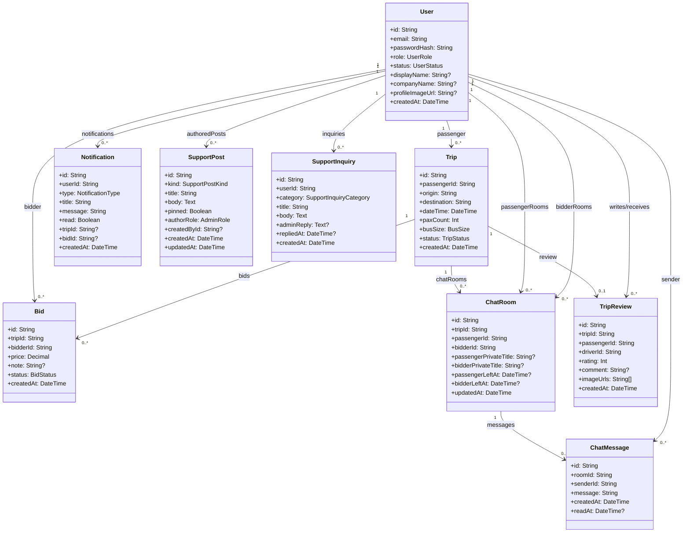

# GoodBus Diagrams

아래 다이어그램은 Mermaid 지원 환경(예: GitHub, Notion 일부, Mermaid Live Editor)에서 렌더링됩니다.

## 1) 유스케이스 다이어그램

```mermaid
flowchart LR
    Passenger([승객])
    Driver([기사])
    Company([운수업체])
    Admin([관리자])

    subgraph GoodBus[GoodBus 시스템]
        UC1((회원가입/로그인))
        UC2((견적 요청 등록))
        UC3((내 여정 조회/취소))
        UC4((입찰 제안 확인))
        UC5((입찰 낙찰))
        UC6((채팅))
        UC7((알림 확인))
        UC8((리뷰 작성))
        UC9((입찰 참여))
        UC10((내 입찰 조회/철회))
        UC11((프로필/차량 정보 관리))
        UC12((인증서류 업로드))
        UC13((공지/FAQ 조회))
        UC14((1:1 문의 등록))
        UC15((관리자 대시보드 조회))
        UC16((유저 상태 관리))
        UC17((인증 승인/반려))
        UC18((공지/FAQ 관리))
    end

    Passenger --> UC1
    Passenger --> UC2
    Passenger --> UC3
    Passenger --> UC4
    Passenger --> UC5
    Passenger --> UC6
    Passenger --> UC7
    Passenger --> UC8
    Passenger --> UC13
    Passenger --> UC14

    Driver --> UC1
    Driver --> UC9
    Driver --> UC10
    Driver --> UC6
    Driver --> UC7
    Driver --> UC11
    Driver --> UC12
    Driver --> UC13
    Driver --> UC14

    Company --> UC1
    Company --> UC9
    Company --> UC10
    Company --> UC6
    Company --> UC7
    Company --> UC11
    Company --> UC12
    Company --> UC13
    Company --> UC14

    Admin --> UC15
    Admin --> UC16
    Admin --> UC17
    Admin --> UC18
```

## 2) 클래스 다이어그램 (도메인 중심)

```mermaid
classDiagram
    class User {
      +id: String
      +email: String
      +passwordHash: String
      +role: UserRole
      +status: UserStatus
      +displayName: String?
      +companyName: String?
      +profileImageUrl: String?
      +createdAt: DateTime
    }

    class Trip {
      +id: String
      +passengerId: String
      +origin: String
      +destination: String
      +dateTime: DateTime
      +paxCount: Int
      +busSize: BusSize
      +status: TripStatus
      +createdAt: DateTime
    }

    class Bid {
      +id: String
      +tripId: String
      +bidderId: String
      +price: Decimal
      +note: String?
      +status: BidStatus
      +createdAt: DateTime
    }

    class ChatRoom {
      +id: String
      +tripId: String
      +passengerId: String
      +bidderId: String
      +passengerPrivateTitle: String?
      +bidderPrivateTitle: String?
      +passengerLeftAt: DateTime?
      +bidderLeftAt: DateTime?
      +updatedAt: DateTime
    }

    class ChatMessage {
      +id: String
      +roomId: String
      +senderId: String
      +message: String
      +createdAt: DateTime
      +readAt: DateTime?
    }

    class TripReview {
      +id: String
      +tripId: String
      +passengerId: String
      +driverId: String
      +rating: Int
      +comment: String?
      +imageUrls: String[]
      +createdAt: DateTime
    }

    class Notification {
      +id: String
      +userId: String
      +type: NotificationType
      +title: String
      +message: String
      +read: Boolean
      +tripId: String?
      +bidId: String?
      +createdAt: DateTime
    }

    class SupportPost {
      +id: String
      +kind: SupportPostKind
      +title: String
      +body: Text
      +pinned: Boolean
      +authorRole: AdminRole
      +createdById: String?
      +createdAt: DateTime
      +updatedAt: DateTime
    }

    class SupportInquiry {
      +id: String
      +userId: String
      +category: SupportInquiryCategory
      +title: String
      +body: Text
      +adminReply: Text?
      +repliedAt: DateTime?
      +createdAt: DateTime
    }

    User "1" --> "0..*" Trip : passenger
    User "1" --> "0..*" Bid : bidder
    Trip "1" --> "0..*" Bid : bids

    Trip "1" --> "0..*" ChatRoom : chatRooms
    User "1" --> "0..*" ChatRoom : passengerRooms
    User "1" --> "0..*" ChatRoom : bidderRooms
    ChatRoom "1" --> "0..*" ChatMessage : messages
    User "1" --> "0..*" ChatMessage : sender

    Trip "1" --> "0..1" TripReview : review
    User "1" --> "0..*" TripReview : writes/receives

    User "1" --> "0..*" Notification : notifications
    User "1" --> "0..*" SupportInquiry : inquiries
    User "1" --> "0..*" SupportPost : authoredPosts
```
